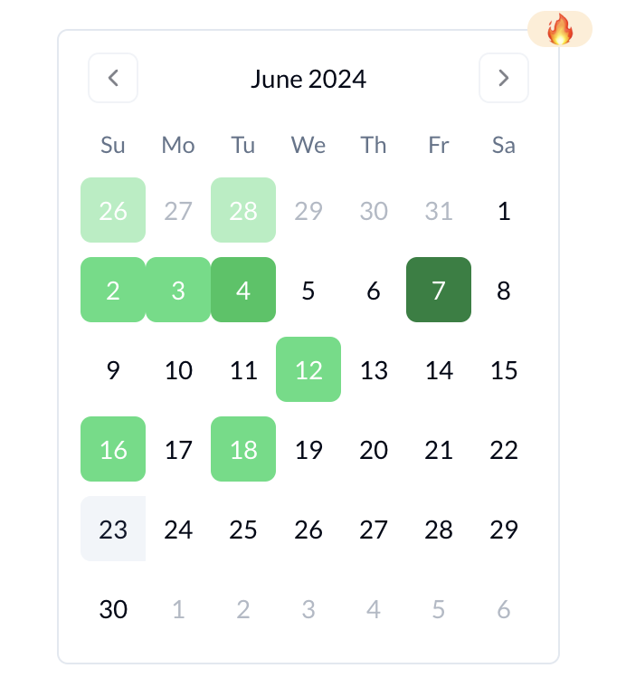

# shadcn-calendar-heatmap

A modern, customizable calendar heatmap component built on top of [react-day-picker](https://react-day-picker.js.org/) following [shadcn/ui](https://ui.shadcn.com/) patterns.

**Accessible. Unstyled. Customizable. Open Source.**



## ✨ Features

- 🎨 **Fully Customizable** - Style with Tailwind CSS classes
- 📅 **Multiple Data Modes** - Use direct date arrays or weighted dates with auto-categorization
- 🔢 **Multi-month Support** - Display any number of months
- ♿ **Accessible** - Built on react-day-picker with full keyboard navigation
- 🎯 **Type Safe** - Written in TypeScript with full type definitions
- 🌈 **Preset Variants** - GitHub streaks, temperature heatmaps, rainbow colors, and more

## 🚀 Demo

Check out the live demo at [shadcn-calendar-heatmap.vercel.app](https://shadcn-calendar-heatmap.vercel.app)

## 📦 Installation

This component follows the shadcn/ui philosophy - copy the component directly into your project.

### 1. Install Dependencies

```bash
npm install react-day-picker date-fns lucide-react
# or
yarn add react-day-picker date-fns lucide-react
# or
pnpm add react-day-picker date-fns lucide-react
```

### 2. Copy the Component

Copy [`components/ui/calendar-heatmap.tsx`](https://github.com/gurbaaz27/shadcn-calendar-heatmap/blob/main/components/ui/calendar-heatmap.tsx) into your project's components directory.

### 3. Ensure you have the required utilities

Make sure you have the `cn` utility function (standard in shadcn/ui projects):

```typescript
// lib/utils.ts
import { type ClassValue, clsx } from "clsx"
import { twMerge } from "tailwind-merge"

export function cn(...inputs: ClassValue[]) {
  return twMerge(clsx(inputs))
}
```

## 📖 Usage

### Basic Example - GitHub Contribution Graph

```tsx
import { CalendarHeatmap } from "@/components/ui/calendar-heatmap"

export default function MyComponent() {
  return (
    <CalendarHeatmap
      variantClassnames={[
        "text-white hover:text-white bg-green-400 hover:bg-green-400",
        "text-white hover:text-white bg-green-500 hover:bg-green-500",
        "text-white hover:text-white bg-green-700 hover:bg-green-700",
      ]}
      datesPerVariant={[
        [new Date('Jan 1, 2024'), new Date('Jan 15, 2024')],
        [new Date('Jun 12, 2024'), new Date('July 1, 2024')],
        [new Date('Jan 19, 2024'), new Date('Apr 14, 2024')],
      ]}
    />
  )
}
```

### Using Weighted Dates

Pass dates with numeric weights, and the component auto-categorizes them:

```tsx
<CalendarHeatmap
  variantClassnames={[
    "text-white hover:text-white bg-blue-300 hover:bg-blue-300",
    "text-white hover:text-white bg-green-500 hover:bg-green-500",
    "text-white hover:text-white bg-amber-400 hover:bg-amber-400",
    "text-white hover:text-white bg-red-700 hover:bg-red-700",
  ]}
  weightedDates={[
    { date: new Date('Jan 1, 2024'), weight: 2 },
    { date: new Date('Jun 12, 2024'), weight: 8 },
    { date: new Date('Apr 19, 2024'), weight: 13.5 },
  ]}
/>
```

### Multi-month Display

```tsx
<CalendarHeatmap
  numberOfMonths={3}
  variantClassnames={[...]}
  datesPerVariant={[...]}
/>
```

## 🔧 API Reference

### Props

| Prop | Type | Required | Description |
|------|------|----------|-------------|
| `variantClassnames` | `string[]` | ✅ | Array of Tailwind CSS classes for each intensity level |
| `datesPerVariant` | `Date[][]` | ⚡ | 2D array where each inner array contains dates for that variant |
| `weightedDates` | `WeightedDateEntry[]` | ⚡ | Array of `{ date: Date, weight: number }` objects |
| `numberOfMonths` | `number` | ❌ | Number of months to display (default: 1) |
| `showOutsideDays` | `boolean` | ❌ | Show days from adjacent months (default: true) |

> ⚡ You must provide either `datesPerVariant` OR `weightedDates`, not both.

The component also accepts all props from [react-day-picker](https://react-day-picker.js.org/api/interfaces/DayPickerMultipleProps).

### Types

```typescript
type WeightedDateEntry = {
  date: Date
  weight: number
}
```

## 🎨 Customization Examples

### Temperature Heatmap

```tsx
const Heatmap = [
  "text-white hover:text-white bg-blue-300 hover:bg-blue-300",   // Cold
  "text-white hover:text-white bg-green-500 hover:bg-green-500", // Mild
  "text-white hover:text-white bg-amber-400 hover:bg-amber-400", // Warm
  "text-white hover:text-white bg-red-700 hover:bg-red-700",     // Hot
]
```

### Rainbow Colors

```tsx
const Rainbow = [
  "text-white hover:text-white bg-violet-400 hover:bg-violet-400",
  "text-white hover:text-white bg-indigo-400 hover:bg-indigo-400",
  "text-white hover:text-white bg-blue-400 hover:bg-blue-400",
  "text-white hover:text-white bg-green-400 hover:bg-green-400",
  "text-white hover:text-white bg-yellow-400 hover:bg-yellow-400",
  "text-white hover:text-white bg-orange-400 hover:bg-orange-400",
  "text-white hover:text-white bg-red-400 hover:bg-red-400",
]
```

## ⭐ Star History

<a href="https://star-history.com/#gurbaaz27/shadcn-calendar-heatmap&Date">
 <picture>
   <source media="(prefers-color-scheme: dark)" srcset="https://api.star-history.com/svg?repos=gurbaaz27/shadcn-calendar-heatmap&type=Date&theme=dark" />
   <source media="(prefers-color-scheme: light)" srcset="https://api.star-history.com/svg?repos=gurbaaz27/shadcn-calendar-heatmap&type=Date" />
   
 </picture>
</a>

## 🤝 Contributing

Contributions are welcome! Feel free to open an issue or submit a pull request.

## 📄 License

MIT © [Gurbaaz Singh Nandra](https://x.com/GurbaazNandra)

## 🔗 Links

- [Live Demo](https://shadcn-calendar-heatmap.vercel.app)
- [GitHub Repository](https://github.com/gurbaaz27/shadcn-calendar-heatmap)
- [Twitter/X](https://x.com/GurbaazNandra)
